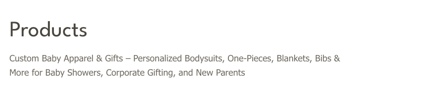
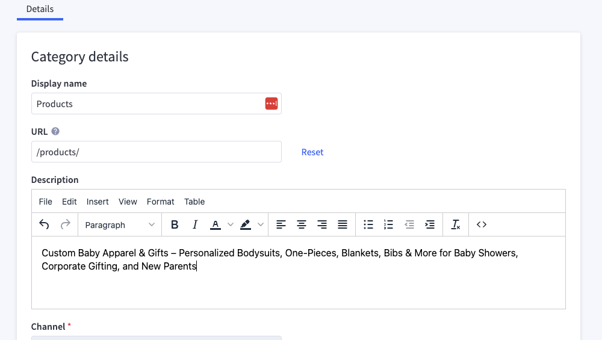
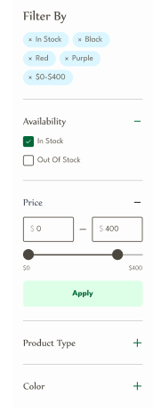
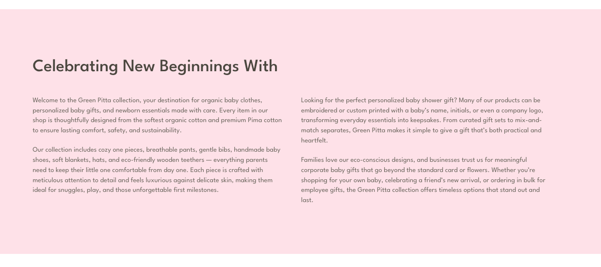
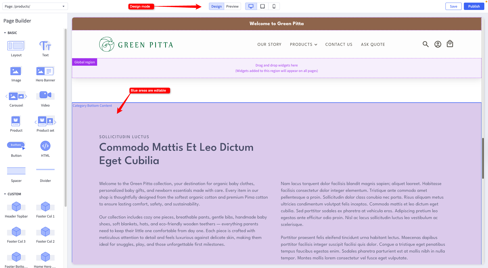
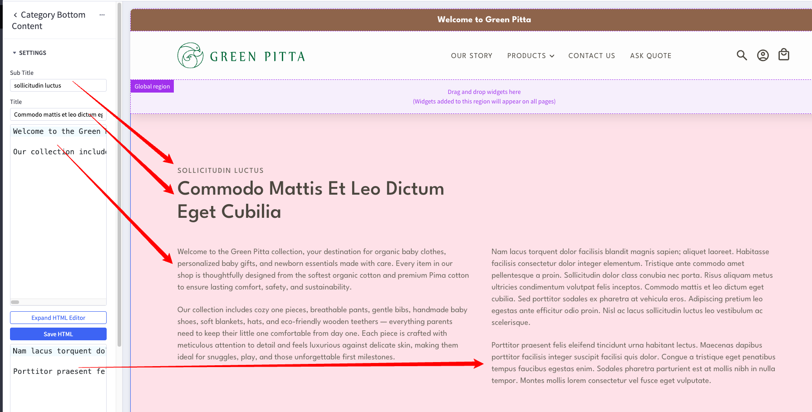
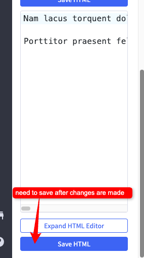
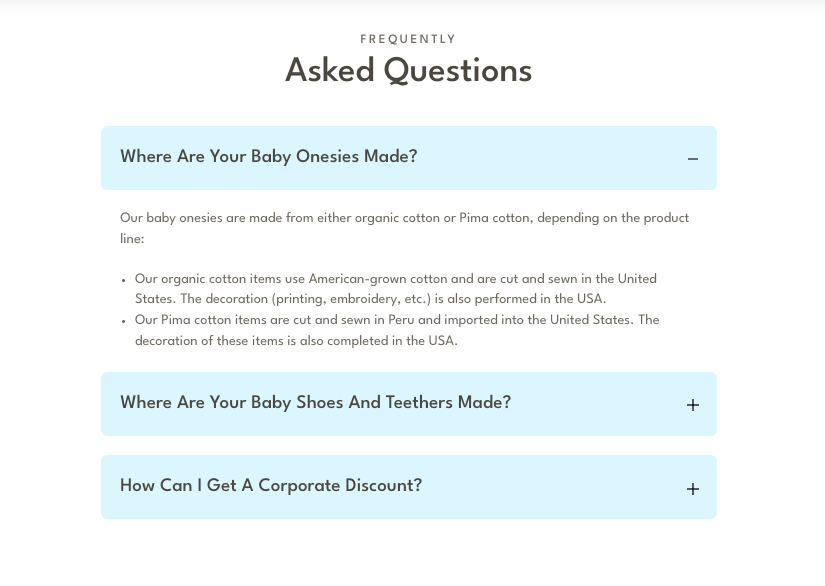
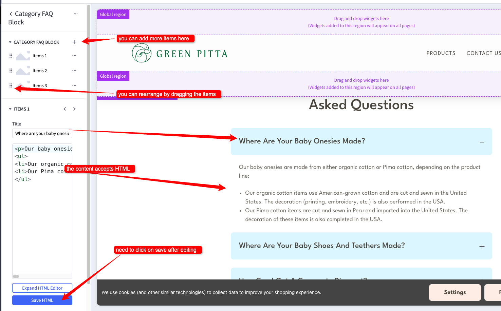

# Category Page
The category page lists all the products in the category.

## Title and Description

It contains the category name and description.

We used the built-in BigCommerce category settings for this.

To edit it, go to the category settings in BigCommerce. Please refer to the documentation <a href="https://support.bigcommerce.com/s/article/Product-Categories?language=en_US" target="_blank">here</a> for more instructions.

## Filters

The filters are used to filter the products based on the price, brand, and other custom fields or product attributes.

⚠️ A BigCommerce Pro plan or higher is required to use the product filtering feature. ⚠️

For more information about the BigCommerce filters, see the <a href="https://support.bigcommerce.com/s/article/Product-Filtering-Settings" target="_blank">BigCommerce documentation</a>.

## Category Bottom Content

The category bottom content is using the custom 'Category Bottom content' widget. To edit it, go to the [Page Builder](index.md/#page-builder), click on it while in Design mode, and edit the settings on the left pannel.

## FAQ

The FAQ section is using the custom 'Category FAQ' widget. To edit it, go to the [Page Builder](index.md/#page-builder), click on it while in Design mode, and edit the settings on the left pannel.

