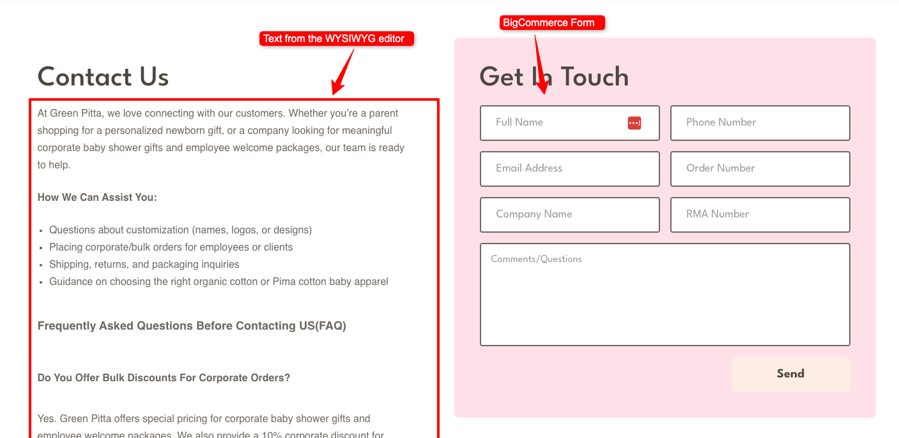
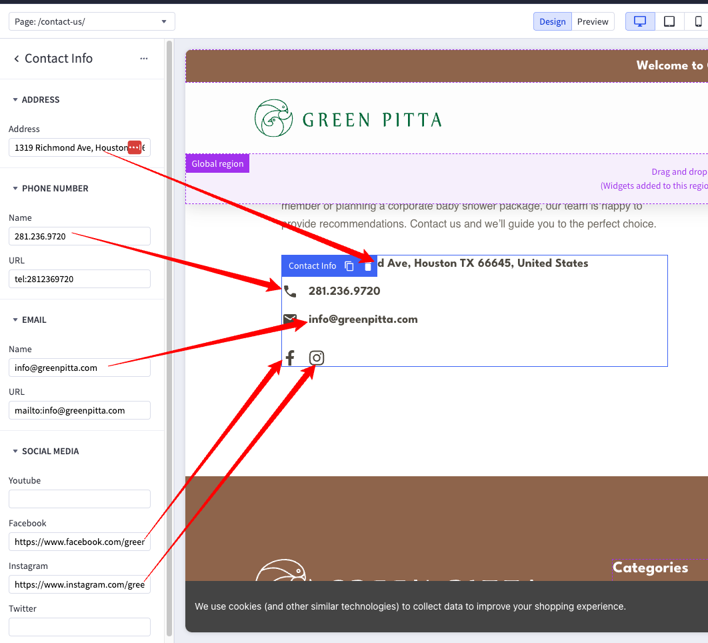

# Contact Page
For the 'Contact' page, we are using the BigCommerce form. You can manage the form fields in your BigCommerce control panel by following the documentation <a href="https://support.bigcommerce.com/s/article/Creating-a-Contact-Form?language=en_US" target="_blank" rel="noopener noreferrer">here</a>.

The contact information section is using the custom 'Contact Info' widget. You can change it in the [Page Builder](index.md/#page-builder), by clicking on it while in Design mode, and editing the settings on the left pannel.

