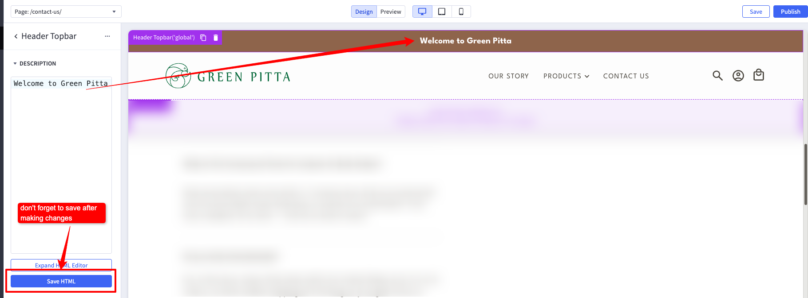
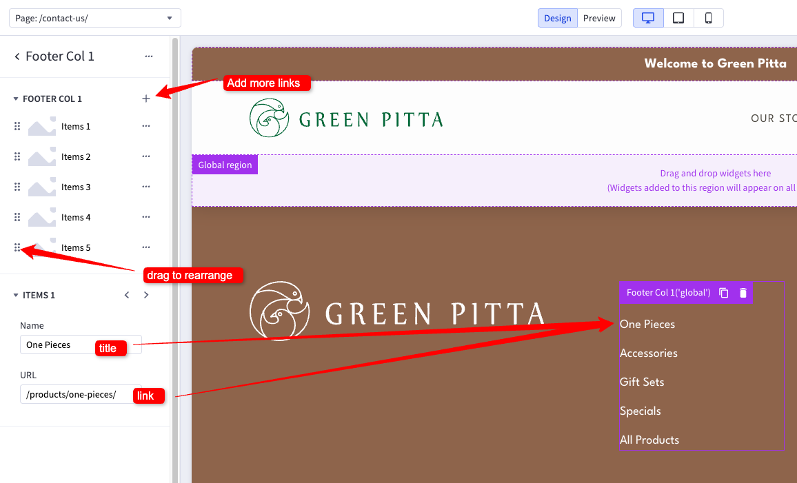
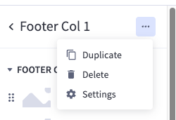
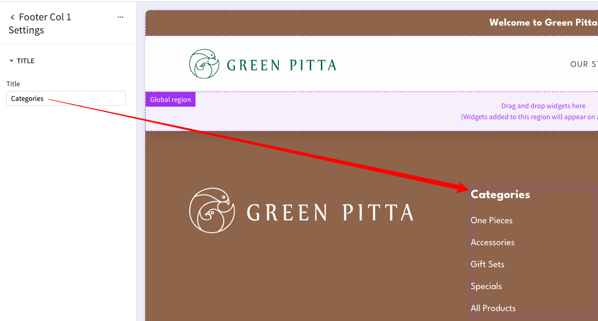
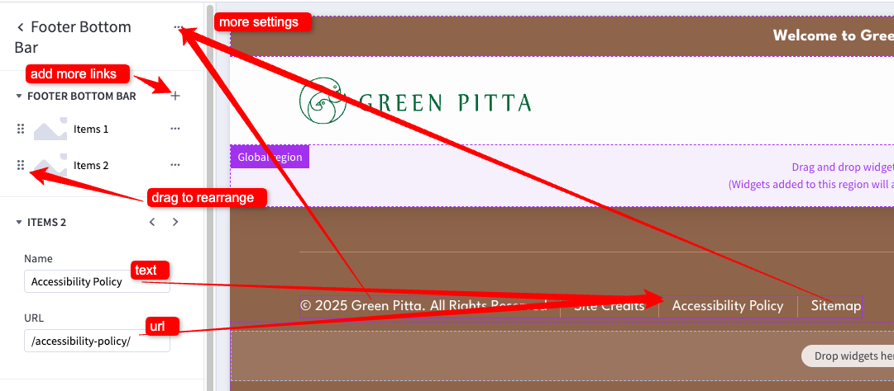
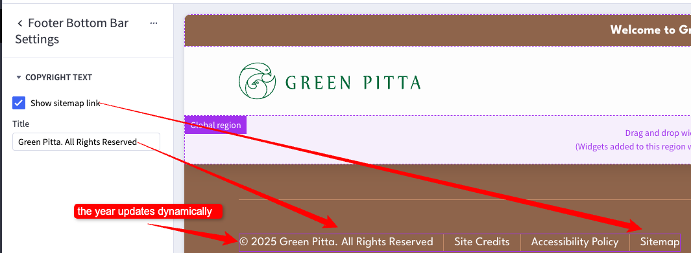
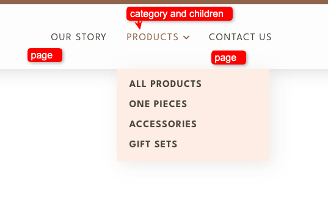
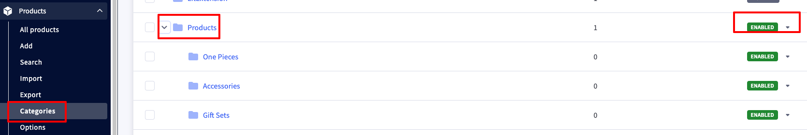

# Header and Footer

## Top Bar
The Top Bar is using the custom 'Header Topbar' widget. You can change it in the [Page Builder](index.md/#page-builder), by clicking on it while in Design mode, and editing the settings on the left pannel.

## Footer
The Footer is using the custom 'Footer Col' widgets. You can change it in the [Page Builder](index.md/#page-builder), by clicking on it while in Design mode, and editing the settings on the left pannel.

You can also change the name of the column by clicking on the ellipses on the top of the widget, and selecting 'Settings'.

## Footer Bottom
The Footer Bottom Links is using the custom 'Footer Bottom Bar' widget. You can change it in the [Page Builder](index.md/#page-builder), by clicking on it while in Design mode, and editing the settings on the left pannel.

You can also change some settings by clicking on the ellipses on the top of the widget, and selecting 'Settings'.

## Menu

The menu accepts pages with the names: 'Our Story', 'Contact', 'Custom Design'.

The 'Product' menu item automatically displays the first visible category and its child categories, which you can manage in the BigCommerce dashboard by editing your store’s categories.

