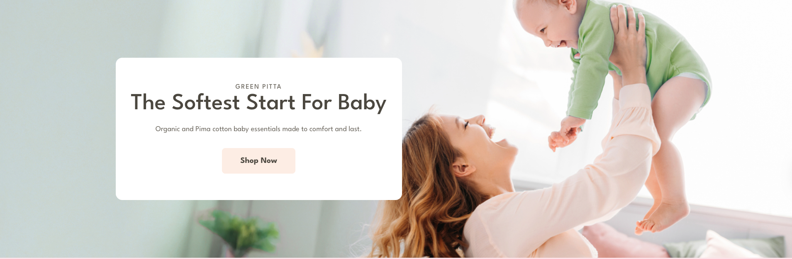
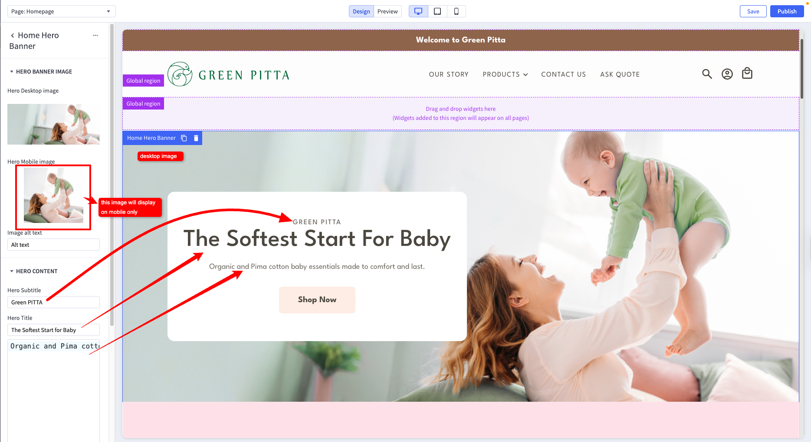
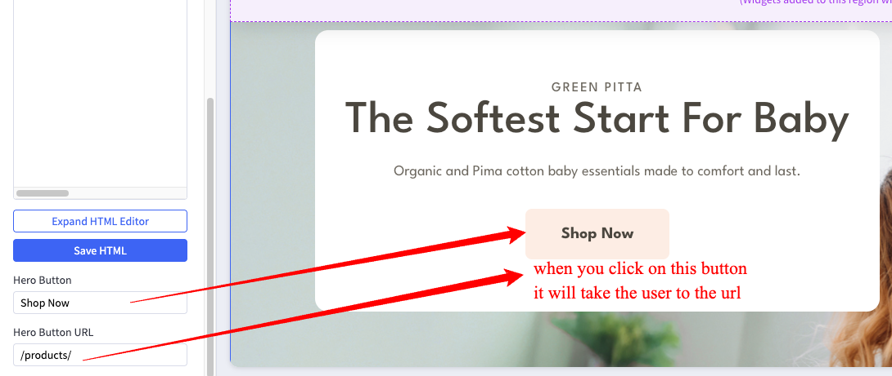
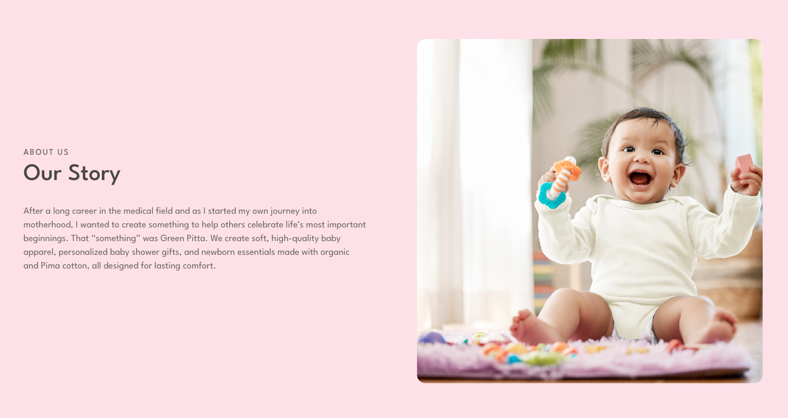
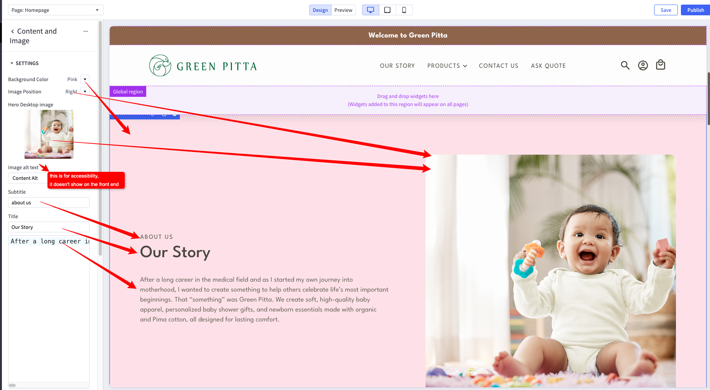
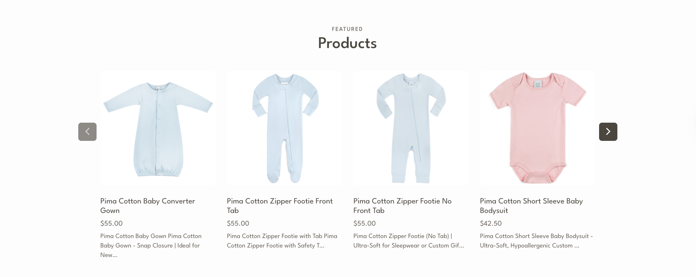
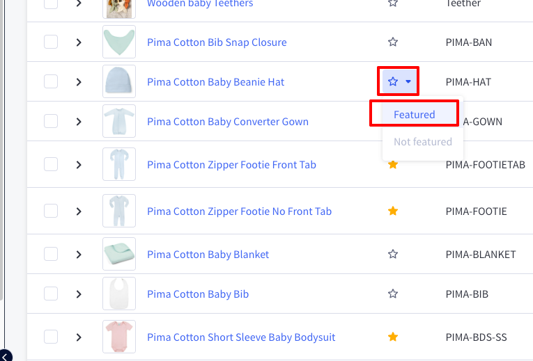
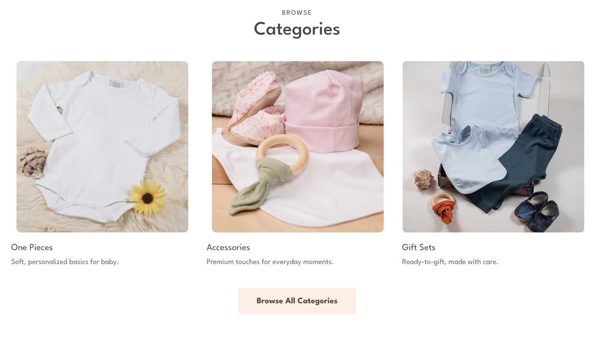
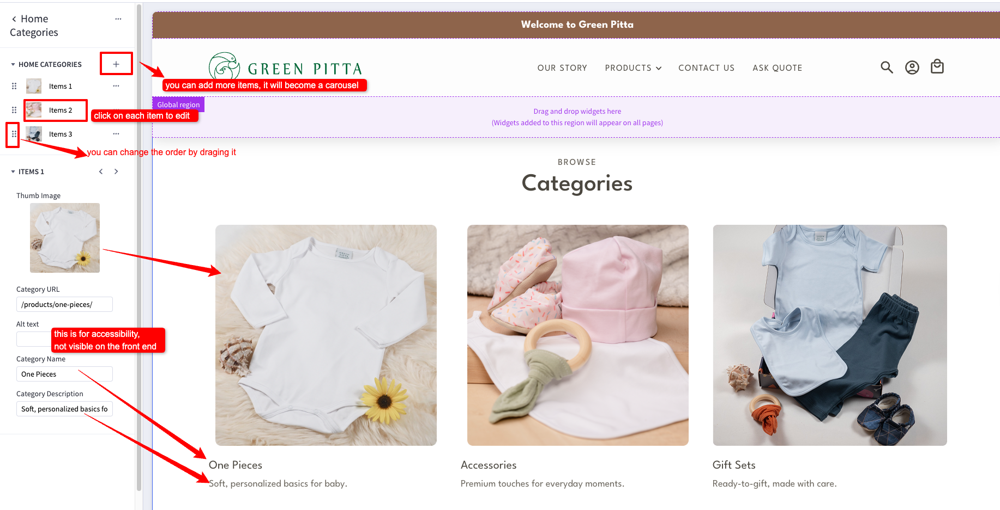

# Homepage
The homepage is the main page of the website. It is the first page that the user sees when they visit the website.

## Hero Banner

The Hero Banner is using the custom 'Home Hero Banner' widget. You can change it in the [Page Builder](index.md/#page-builder), by clicking on it while in Design mode, and editing the settings on the left pannel.
The same block is also used at the bottom of the homepage.

## Image and Text Block

The Image and Text Block is using the custom 'Content and Image' widget. You can change it in the [Page Builder](index.md/#page-builder), by clicking on it while in Design mode, and editing the settings on the left pannel.

## Featured Products

The Featured Products panel displays products that you have marked as Featured.
To mark a product as Featured, simply go to the product listing via Products->View, then click on the star symbol on the product you want to display.

## Categories Block

The Categories Block is using the custom 'Home Categories' widget. You can change it in the [Page Builder](index.md/#page-builder), by clicking on it while in Design mode, and editing the settings on the left pannel.

