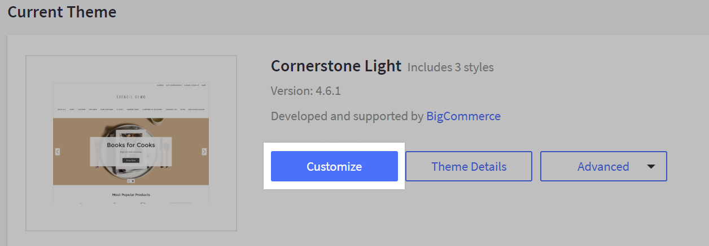
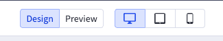
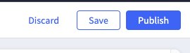
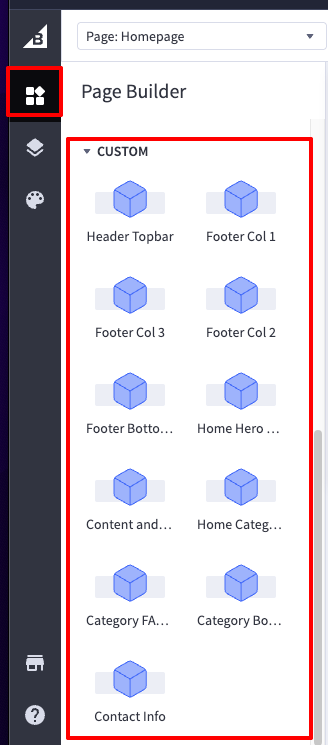

# Welcome to Green Pitta's theme by Coalition Technologies - documentation

## Developers info

* Base theme: Cornerstone 6.15.0
* Node: 18.15.0
* Command: stencil start

## Project templates
* [Homepage](home/)
* [Category Page](category/)
* [Product Page](product/)
* [Reviews Page](reviews/)
* [Contact Page](contact/)
* [Mega Menu](menu/)

## Before You Begin

Before using the custom features we built for your theme, it’s important to first get familiar with the standard BigCommerce tools.

👉 Please take some time to review their documentation here:
<a href="https://support.bigcommerce.com/s/knowledge?language=en_US" target="_blank">BigCommerce Documentation</a>

This will give you a clear understanding of what the platform does by default (content entry, product setup, categories, etc.), and what we customized (theme templates, widgets, and layouts). Once you’re comfortable with the basics, this guide will help you use the customizations we developed.

## Page Builder
Page Builder allows you to customize a few (not all) style elements of your theme, like colors, text sizes, the number of featured products to show on the homepage, and more.

In addition, you can drag and drop content onto pages, like text blocks, images, videos, banners, carousels, buttons, and blocks of custom HTML.

To access Page Builder go to Storefront › Themes › Customize to launch Page Builder. You can also read more about the Page builder in this <a href="https://support.bigcommerce.com/s/article/Page-Builder?language=en_US#using" target="_blank">documentation</a>.

Whenever we need to edit the site, we need to be in 'Design' mode. And whenever we need to test the site, we need to be in 'Preview' mode. You can also test on different screen sizes by clicking on the icons at the top of the Page Builder.

### Common Issue ⚠️

While editing the widgets in Design mode, sometimes they seem to break, but this is because the scripts stop running. If this happens, you can fix it by clicking on 'Save' in the top right corner of the Page Builder.

After clicking on 'Save', you can click on 'Preview' to see the changes in action. If you want to see the changes on the live site, you need to click on 'Publish'.

## Custom Widgets
Custom widgets are developed by Coalition Technologies according to the mockups.

They can be used in the Page Builder. You can find them in the Page Builder under the Custom Widgets section.

