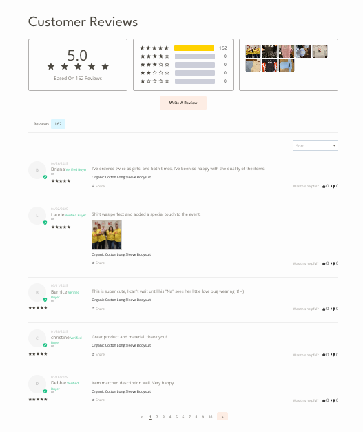
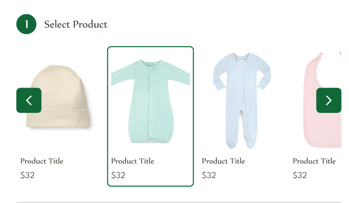

# Product Page
The product page displays the information about the product. It includes the product name, description, price, options, and images of the product.

Most of the product page is built with the default BigCommerce settings, for more information regarding how to add a product in Bigcommerce, refer to this <a href="https://support.bigcommerce.com/s/article/Products-Overview?language=en_US" target="_blank">documentation</a>. 

The product page contains items from third-party apps, like the reviews section, which is powered by the <a href="https://www.stamped.io/" target="_blank">Stamped.io</a> app.

The customization of the product, which is powered by the <a href="https://www.designnbuy.com/" target="_blank">Design'N'Buy</a>.

The additional custom section, where a user can select another product, is powered by the related products feature of BigCommerce.

⚠️ The custom section is currently not displayed, as it was removed by a third-party developer. ⚠️
